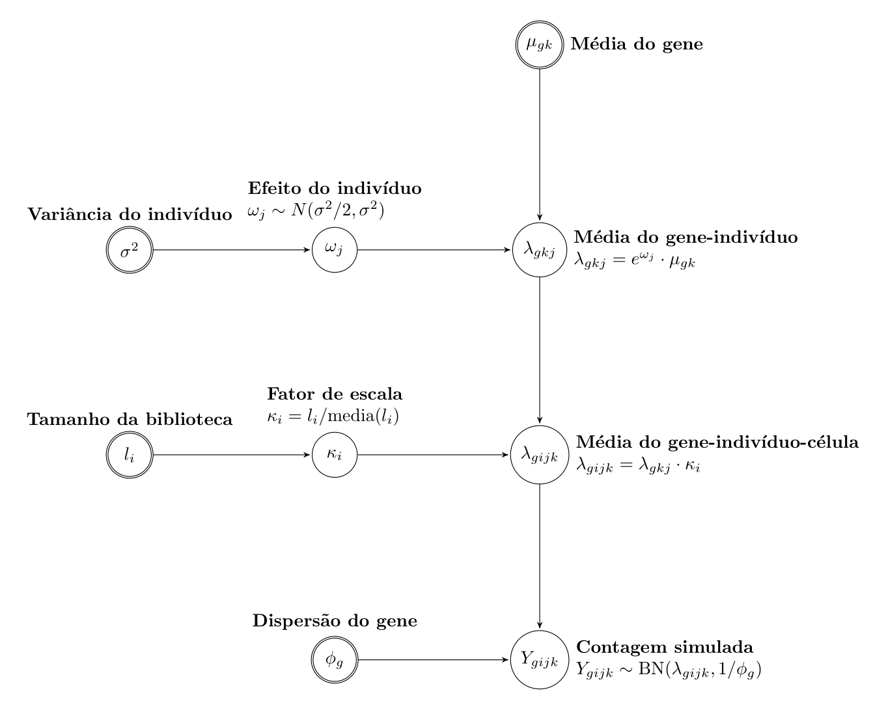

<!-- README.md is generated from README.Rmd. Please edit that file -->

## Estudo de simulação

<!-- badges: start -->

<!-- badges: end -->

  - **Objetivo:** comparar propriedades estatísticas (erro do Tipo I e
    poder) dos modelos discutidos na análise de expressão gênica quando
    as células sequenciadas são oriundas de diferentes organismos, por
    exemplo, indivíduos.

  - **Motivação:** não controlar erro do Tipo I leva a um número
    expressivos de genes DE que não são DE (falsos positivos).

  - **Modelos:**
    
      - `MLM`: modelo linear misto utilizando expressões
        \(\log_2\)-normalizadas com pesos nas observações;
    
      - `edgeR-sc`: modelo edgeR considerando as contagens observadas em
        cada célula;
    
      - `edgeR-bulk`: modelo edgeR considerando amostras pseudo-bulk.

### Como simular os dados?

  - Proposta adaptada de [Lun e Marioni
    (2017)](https://academic.oup.com/biostatistics/article/18/3/451/2970368).

